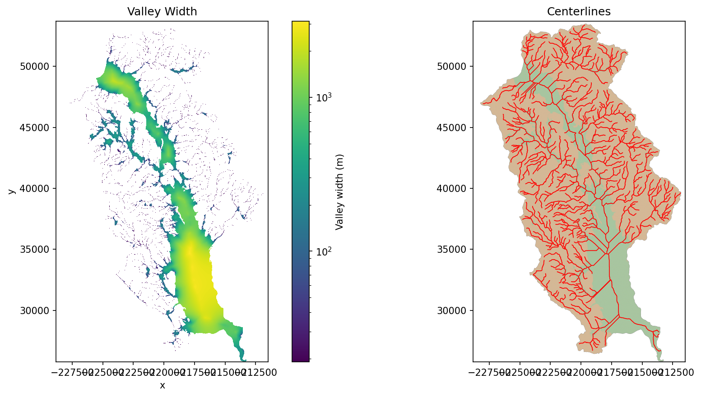

# valley-axis

Derives valley centerlines and computes continuous valley width across a valley
floor mask. Designed for river corridor analysis where valley setting needs to
be characterized across a watershed.



## Installation

```bash
pip install git+https://github.com/avkoehl/valley-axis.git
```

With development dependencies:

```bash
git clone https://github.com/avkoehl/valley-axis.git
cd valley-axis
uv sync --dev
```

install jupyter kernel:
```bash
uv run python -m ipykernel install --user --name=valley-axis
```

## Usage

```python
import valley_axis as va

# Full workflow
centerlines_gdf, centerlines_raster, widths = va.measure_width(
    dem=dem,
    region_raster=region_mask,
    flowlines=flowlines,
    centerline_method="mcp",   # or "skeleton"
    width_method="laplace",    # or "idw", "voronoi"
)

# Centerlines only
centerlines_gdf, centerlines_raster = va.get_centerlines(
    dem=dem,
    region_raster=region_mask,
    flowlines=flowlines,
    method="mcp",
)

# Widths from existing centerlines
widths = va.get_widths(
    centerlines_raster=centerlines_raster,
    region_raster=region_mask,
    method="laplace",
)
```

**Inputs**
- `dem`: `xarray.DataArray` — digital elevation model with CRS and spatial metadata
- `region_raster`: `xarray.DataArray` — binary valley floor mask (1 = valid)
- `flowlines`: `geopandas.GeoDataFrame` — stream network linestrings

**Outputs**
- `centerlines_gdf`: `geopandas.GeoDataFrame` — vector centerlines
- `centerlines_raster`: `xarray.DataArray` — rasterized centerlines
- `widths`: `xarray.DataArray` — continuous valley width in meters across the full valley floor

## References

Kienholz, C., Rich, J. L., Arendt, A. A., & Hock, R. (2014). A new method for deriving glacier centerlines applied to glaciers in Alaska and northwestern Canada. *The Cryosphere*, 8, 503–519. https://tc.copernicus.org/articles/8/503/2014/tc-8-503-2014.pdf

Jones, S. E., Buchbinder, B. R., & Aharon, I. (2000). Three-dimensional mapping of cortical thickness using Laplace's equation. *Human Brain Mapping*, 11(1), 12–32. https://pubmed.ncbi.nlm.nih.gov/10997850/
